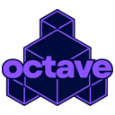

<p align="center">
  
</p>

# Octave

A 3D Game Engine for GameCube, Wii, 3DS, Windows, Linux, and Android

[Tutorial Video](https://youtu.be/0CHLn0ie-DY?si=pq-s_hLgb71OX2Cc)

[Lua Documentation](Documentation/Lua/README.md)

[Editor Hotkeys](Documentation/Info/Editor.md)

Check out the Releases page for precompiled standalone builds.

Instructions for building from source below.

## Windows Setup
1. Download and Install:
	- Visual Studio Community 2022 (with C++ support)
	- Vulkan SDK version 1.3.275.0 (During install select "Shader Toolchain Debug Symbols - 64 bit" and deselect all other options)
    - devkitPPC for GameCube/Wii development
    - devkitARM for 3DS development
2. Build shaders by running compile.bat in Engine/Shaders/GLSL
3. Open Octave.sln
4. Switch to the DebugEditor solution configuration
5. Set the Standalone project as the Startup Project
6. In the debug settings for Standalone, change the working directory to $(SolutionDir)
7. Build and run Standalone. This is the standalone level edtior if you were making a game with Lua script only.

## Linux Setup
1. sudo apt install g++
2. sudo apt install make
3. sudo apt install libx11-dev
4. sudo apt install libasound2-dev
5. Install Vulkan SDK version 1.3.275.0
    - Download the 1.3.275.0 tar file from https://vulkan.lunarg.com/sdk/home#linux
    - Extract the tar file somewhere (e.g. ~/VulkanSDK/)
    - Add these to your ~/.bashrc file (replace `~/VulkanSDK` with the directory where you extracted the files to). You may instead add these to a .sh file in your /etc/profiles.d directory to set up Vulkan for all users.
        ```
        export VULKAN_SDK=~/VulkanSDK/1.3.275.0/x86_64
        export PATH=$VULKAN_SDK/bin:$PATH
        export LD_LIBRARY_PATH=$VULKAN_SDK/lib${LD_LIBRARY_PATH:+:$LD_LIBRARY_PATH}
        export VK_LAYER_PATH=$VULKAN_SDK/share/vulkan/explicit_layer.d
        ```
    - Close and reopen your terminal to apply the .bashrc (or run `source ~/.bashrc`)
6. Install devkitPro Pacman for GameCube/Wii/3DS development (Optional) (https://devkitpro.org/wiki/devkitPro_pacman)
    - wget https://apt.devkitpro.org/install-devkitpro-pacman
    - chmod +x ./install-devkitpro-pacman
    - sudo ./install-devkitpro-pacman
7. Install GameCube/Wii/3DS development libraries (Optional) (https://devkitpro.org/wiki/Getting_Started)
    - sudo dkp-pacman -S gamecube-dev
    - sudo dkp-pacman -S wii-dev
    - sudo dkp-pacman -S 3ds-dev
    - Restart computer
8. cd Engine/Shaders/GLSL/ then run ./compile.sh

### Linux Setup (Visual Studio Code)
9. Open the root octave folder in VsCode (where this README is located).
10. Install the C/C++ Extension Pack
11. Run the Octave Editor config (click the Run and Debug tab on the left, then in the drop down where the green Play button is, select `Octave Editor`)

### Linux Setup (Terminal)
9. From the project's root directory (where this README is located) `cd Standalone`
10. Run `make -f Makefile_Linux_Editor`
11. Go back to the root directory `cd ..`
12. Run `Standalone/Build/Linux/OctaveEditor.elf` It's important that the working directory is the root directory where the Engine and Standalone folders are located.

## Packaging
1. When packaging for any platform on a Windows machine, you will likely need to install Msys2 so that linux commands can be executed. This comes packaged along with devkitPro libraries, so you if you install the devkitPro libraries, you shouldn't need to worry about this.
2. Packaging for Android requires installing Android Studio (Last tested with Android Studio 2022.2.1 Patch 2) with the following tools installed via the SDK Manager:
    - Android SDK Build Tools: 34.0.0
    - Android NDK (Side by side): 25.2.9519653
    - CMake: 3.22.1

## CMake Support
CMake support is currently a work-in-progress, and only Linux support has been implemented and tested. If you want to try building with CMake, here are some tips:
 - Make sure you pull all submodules `git submodule update --init --recursive`
 - Install pkg-config `sudo apt install pkg-config`
 - Install vorbis dev libraries `sudo apt install libvorbis-dev`

## Special Thanks
 - Octave logo designed by overcookedchips.